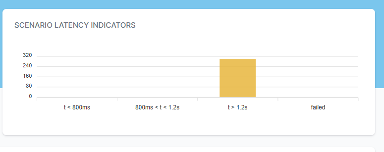
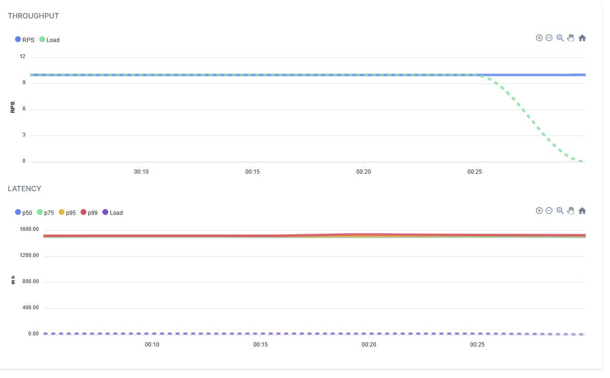
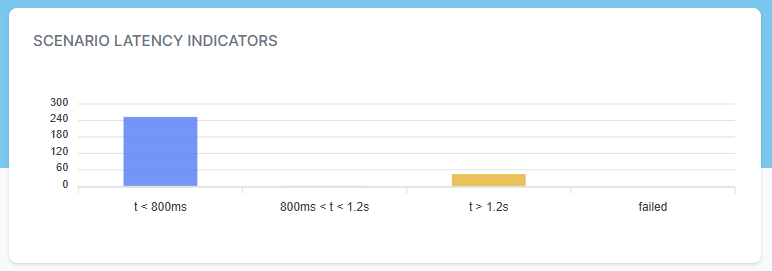
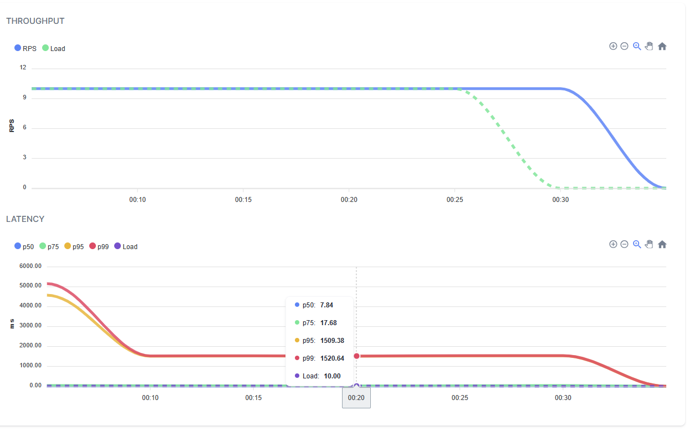
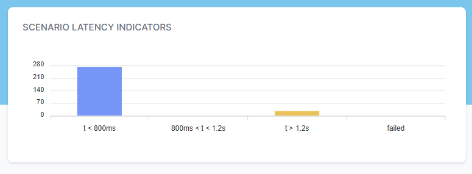
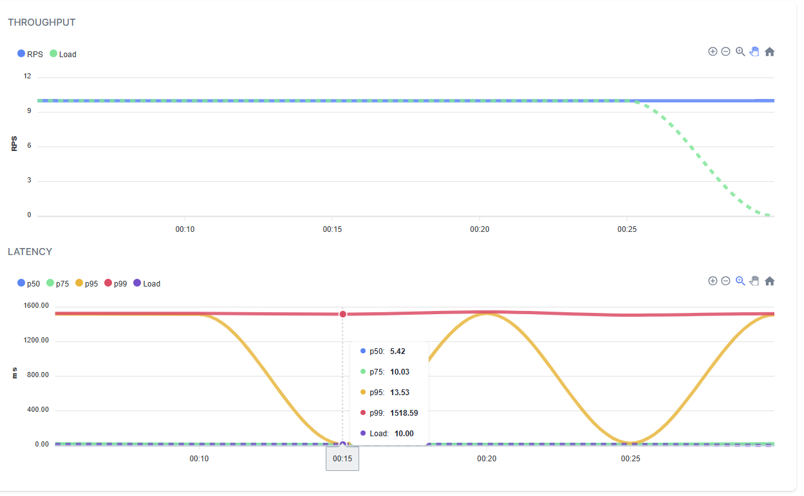

title: Caching exploration in .NET
created: Tuesday, July 11, 2023
tags:
  - dotnet
  - caching
  - redis
  - docker
  - docker compose
  - YARP
  - NBomber
short: Caching exploration in .NET
pinned: true  
pinOrder: 10
image: /images/multi_layer_cache.png
---

### Multi-Layered Caching in .NET Microservices

Caching plays a crucial role in optimizing the performance and scalability of .NET microservices. It allows frequently accessed data to be stored in memory or fast storage mediums, reducing the need to repeatedly retrieve data from original sources. In this blog post, we will explore the concept of multi-layered caching in .NET microservices and its significance in building highly performant and scalable applications.

#### Introduction

Caching offers several benefits in modern .NET applications:

- **Reduced Latency**: Caching minimizes the latency associated with fetching data from databases or external services, resulting in faster response times and improved user experience.
- **Enhanced Scalability**: By reducing the computational and network resources required to serve requests, caching improves the scalability of microservices, enabling them to handle higher loads efficiently.
- **Improved Resilience**: Caching mitigates the impact of external service failures or outages by providing access to previously cached data, ensuring that the application remains functional even when external dependencies are unavailable.

#### The Need for Caching in .NET Applications

To demonstrate the need for caching in .NET applications, let's create a sample .NET API project using the Minimal API approach. We will use the GenFu library for generating fake data.

First, let's define a data model that will be returned by the search endpoint:

```csharp
public class DataEntity
{
    public string Name { get; set; }
    public string LastName { get; set; }
    public int Age { get; set; }
}
```

Next, we need to create repository and service classes to be used by the endpoint. Here's an example of the IDataRepository interface and its implementation, DataRepository:

```csharp
public interface IDataRepository
{
    Task<IList<DataEntity>> SearchEntities(string name);
    Task Add(string name);
}

 public class DataRepository : IDataRepository
{
    public async Task Add(string name)
    {
        
    }

    public async Task<IList<DataEntity>> SearchEntities(string name)
    {
        await Task.Delay(1500);
        return GenFu.GenFu.ListOf<DataEntity>();
    }
}
```

Similarly, let's define the IDataService interface and its implementation, DataService:

```csharp
 public interface IDataService
{
    Task<IList<DataEntity>> SearchEntities(string name);
    Task Add(string name);
}


 public class DataService : IDataService
{
    readonly IDataRepository repository;
    public DataService(IDataRepository repository)
    {
        this.repository = repository;
    }

    public async Task Add(string name)
    {
        await repository.Add(name);
    }

    public async Task<IList<DataEntity>> SearchEntities(string name)
    {
        return await repository.SearchEntities(name);
    }
}
```

In the above code, we simulate the database read operation by introducing a delay of 1.5 seconds. The implementation for adding data is left empty for now. This setup allows us to simulate the load and reading latency without actually implementing it.

To wire up the dependencies, modify your Program.cs file as follows:

```csharp
using CachingDemo.Cache;
using CachingDemo.Repository;
using CachingDemo.Service;
using Microsoft.AspNetCore.Mvc;

var builder = WebApplication.CreateBuilder(args);


builder.Services.AddScoped<IDataRepository, DataRepository>();
builder.Services.AddScoped<IDataService, DataService>();


var app = builder.Build();

app.MapGet("/search", async ([FromQuery] string name, IDataService service) => await service.SearchEntities(name));
app.MapGet("/add", async ([FromQuery] string name, IDataService service) => await service.Add(name));

app.Run();

```


By running the application, you will have two endpoints: /search for searching entities and /add for adding entities. Note that the /add endpoint should ideally be a POST request, but for simplicity, we are using a GET request in this example.

To test the search endpoint, you can use a URL like the following:

```bash
https://localhost:7220/search?name=test
```


This will return a JSON array of fake data similar to the following:


```json
[
  {
    "name": "John",
    "lastName": "Doe",
    "age": 25
  },
  {
    "name": "Jane",
    "lastName": "Smith",
    "age": 30
  },
  ...
]

```


Please note that the data is randomly generated and may not match exactly.

In a real-world scenario, the application would be hosted behind a load balancer with multiple instances running simultaneously. In a Kubernetes environment, these instances would be represented as pods within a deployment. To simulate this environment on your local machine, you can use Docker Compose.

Let's add some additional components to our project.


#### Adding YARP for Load Balancing and Docker Compose


We can enhance our project by adding the YARP (Yet Another Reverse Proxy) project for load balancing. Additionally, we'll use Docker Compose to spin up multiple instances of our API.

Create a new project and configure it as follows:

```csharp
var builder = WebApplication.CreateBuilder(args);
builder.Services.AddReverseProxy()
    .LoadFromConfig(builder.Configuration.GetSection("ReverseProxy"));
var app = builder.Build();
app.MapReverseProxy();
app.Run();
```

Add the following configuration to your appsettings.json file:

```json
{
  "Logging": {
    "LogLevel": {
      "Default": "Information",
      "Microsoft.AspNetCore": "Warning"
    }
  },
  "AllowedHosts": "*",


  "ReverseProxy": {
    "Routes": {
      "minimumroute": {
        "ClusterId": "minimumcluster",
        "Match": {
          "Path": "{**catch-all}"
        }
      }
    },
    "Clusters": {
      "minimumcluster": {
        "Destinations": {
          "api1": {
            "Address": "http://api/"
          },
          "api2": {
            "Address": "http://api2/"
          }
        }
      }
    }
  }
}

```

we added routing of content to any of 2 instances of our app that are going to be used in our docker compose.

lets create some Dockerfile

first for our app, name this file Dockerfile

```Dockerfile
FROM mcr.microsoft.com/dotnet/aspnet:7.0 AS base
WORKDIR /app
EXPOSE 80
EXPOSE 443

FROM mcr.microsoft.com/dotnet/sdk:7.0 AS build
WORKDIR /src
COPY ["CachingDemo/CachingDemoApi.csproj", "CachingDemo/"]
RUN dotnet restore "CachingDemo/CachingDemoApi.csproj"
COPY . .
WORKDIR "/src/CachingDemo"
RUN dotnet build "CachingDemoApi.csproj" -c Release -o /app/build

FROM build AS publish
RUN dotnet publish "CachingDemoApi.csproj" -c Release -o /app/publish /p:UseAppHost=false

FROM base AS final
WORKDIR /app
COPY --from=publish /app/publish .
ENTRYPOINT ["dotnet", "CachingDemoApi.dll"]
```

then for YARP project, name this file Dockerfile.YARP

```Dockerfile
FROM mcr.microsoft.com/dotnet/aspnet:7.0 AS base
WORKDIR /app
EXPOSE 80
EXPOSE 443

FROM mcr.microsoft.com/dotnet/sdk:7.0 AS build
WORKDIR /src
COPY ["YARP/YARP.csproj", "YARP/"]
RUN dotnet restore "YARP/YARP.csproj"
COPY . .
WORKDIR "/src/YARP"
RUN dotnet build "YARP.csproj" -c Release -o /app/build

FROM build AS publish
RUN dotnet publish "YARP.csproj" -c Release -o /app/publish /p:UseAppHost=false

FROM base AS final
WORKDIR /app
COPY --from=publish /app/publish .
ENTRYPOINT ["dotnet", "YARP.dll"]
```

Build the Docker images for the API project and YARP project:

```bash
docker build . -t api
docker build . -f .\Dockerfile.YARP -t yarp
```


Create a docker-compose.yml file with the following contents:

```yaml
version: '2.1'
services:
  api:
    image: api
  api2:
    image: api
  yarp:
    image: yarp
    ports:
      - "8002:80"
```


Run Docker Compose to start the instances:

```bash
docker compose up
```

With this setup, Docker Compose will spin up two instances of your API project and one instance of the YARP project, which will forward requests to the API instances.

Now, let's move on to load testing using NBomber.

#### Load Testing with NBomber

To perform load testing, we'll use the NBomber library. Make sure to add the required NuGet packages for NBomber, GenFu, and any other dependencies.

Create a new load testing project and add references to YARP and GenFu.

Configure NBomber in your load testing project as shown below:


```csharp

using NBomber.CSharp;

var httpClient=new HttpClient();


var users = GenFu.GenFu.ListOf<User>();

var scenario = Scenario.Create("test_api_scenario", async context =>
{
    var name = users[GenFu.GenFu.Random.Next(25)].Name;
    await httpClient.GetAsync($"http://localhost:8002/search?name={name}");

    if(GenFu.GenFu.Random.Next(30) % 29 == 0)
        await httpClient.GetAsync($"http://localhost:8002/add?name={name}");

    return Response.Ok();
})
.WithLoadSimulations(
    Simulation.Inject(rate: 10,
                      interval: TimeSpan.FromSeconds(1),
                      during: TimeSpan.FromSeconds(30)),
    Simulation.Pause(during: TimeSpan.FromSeconds(5))
)

;

NBomberRunner
    .RegisterScenarios(scenario)    
    .Run();

class User
{
    public string Name { get; set; }
}
```

In the above code, we define a scenario named "test_api_scenario" that sends HTTP requests to the search endpoint with random names. We also include a conditional request to the add endpoint for every 30th request. The scenario is configured to have an injection rate of 10 requests per second for 30 seconds, followed by a 5-second pause.

Running this load testing project will generate load on your API instances and test their performance.





our load test creates 10 request per second and usual duration is slightly over 1.5 seconds.

#### Implementing Caching

Now, let's add caching to our project using Redis and in-memory caching.

Create the following interfaces and classes for caching:

```csharp
public interface IGenericCache
{
    public Task<T> GetOrSet<T>(string key, Func<Task<T>> getData);
    public Task RemoveItem(string key);
}

public class RedisGenericCache : IGenericCache
{
    readonly IDatabase db;

    public RedisGenericCache(ConnectionMultiplexer redis)
    {            
        db = redis.GetDatabase();
    }

    public async Task<T> GetOrSet<T>(string key, Func<Task<T>> getData)
    {
        var cacheData = await db.StringGetAsync(key);

        if (!cacheData.HasValue)
        {
            var data = await getData();
            var cacheString = System.Text.Json.JsonSerializer.Serialize(data);
            await db.StringSetAsync(key, cacheString);
            cacheData = cacheString;
        }
        return System.Text.Json.JsonSerializer.Deserialize<T>(cacheData);
    }

    public async Task RemoveItem(string key)
    {
        await db.StringGetDeleteAsync(key);
    }
}


```

Create the RedisDataRepository and InMemoryDataRepository implementations:

```csharp
public class RedisDataRepository : RedisGenericCache, IDataRepository
{
    readonly IDataRepository repository;
    public RedisDataRepository(IDataRepository repository, ConnectionMultiplexer redis) : base(redis)
    {
        this.repository = repository;
    }
    public async Task<IList<DataEntity>> SearchEntities(string name)
    {
        return await GetOrSet($"SearchEntities_{name}", () => repository.SearchEntities(name));
    }

    public async Task Add(string name)
    {
        await RemoveItem($"SearchEntities_{name}");
        await repository.Add(name);
    }
}
```

Modify your Program.cs to incorporate the Redis caching:

```csharp
using CachingDemo.Cache;
using CachingDemo.Repository;
using CachingDemo.Service;
using Microsoft.AspNetCore.Mvc;
using Microsoft.Extensions.Caching.Memory;
using StackExchange.Redis;

var builder = WebApplication.CreateBuilder(args);


builder.Services.AddScoped<IDataRepository, DataRepository>();
builder.Services.AddScoped<IDataService, DataService>();


builder.Services.AddSingleton(sp => ConnectionMultiplexer.Connect("redis"));
builder.Services.AddSingleton<RedisGenericCache>();
builder.Services.Decorate<IDataRepository, RedisDataRepository>();

var app = builder.Build();

app.MapGet("/search", async ([FromQuery] string name, IDataService service) => await service.SearchEntities(name));
app.MapGet("/add", async ([FromQuery] string name, IDataService service) => await service.Add(name));

app.Run();
```

In the above code, we register the RedisGenericCache and RedisDataRepository classes as singleton services. We then decorate the IDataRepository service with RedisDataRepository , which provide caching capabilities.

lets shutdown docker compose and build enw version of our api.

```bash
docker compose down
docker build . -t api
```

create file called redis.conf with content (it will be used later) and in file Dockerfile.redis add

```
notify-keyspace-events AKE
```

```Dockerfile
FROM redis
COPY redis.conf /usr/local/etc/redis/redis.conf
CMD [ "redis-server", "/usr/local/etc/redis/redis.conf" ]
```

build redis docker file and lets add redis container to our docker compose file

```bash
docker build . -f .\Dockerfile.redis -t myredis
```


```yaml
version: '2.1'
services:
  redis:
    image: myredis
  api:
    image: api
    depends_on:
      - redis
  api2:
    image: api
    depends_on:
      - redis
  yarp:
    image: yarp
    ports:
      - "8002:80"
```

start our instances and restart the test






wow, but really nobody is surprised that adding caching improves performance greatly.

However using redis (or any other distributed caching mechanism) in real world scenario would add some network latency and some delay. Can we improve this? Can we add some in memory caching to this existing model?

#### Adding in memory caching


add file InMemoryGenericCache.cs

```csharp
public class InMemoryGenericCache : IGenericCache
{
    readonly IMemoryCache cache;
    public InMemoryGenericCache(IMemoryCache cache)
    {
        this.cache = cache;
    }

    public async Task<T> GetOrSet<T>(string key, Func<Task<T>> getData)
    {
        return await cache.GetOrCreateAsync(key, async (e) => await getData());
    }

    public async Task RemoveItem(string key)
    {
        cache.Remove(key);
    }
}
```

and file InMemoryDataRepository.cs

```csharp
public class InMemoryDataRepository : InMemoryGenericCache, IDataRepository
{
    readonly IDataRepository repository;
    public InMemoryDataRepository(IDataRepository repository, IMemoryCache cache) : base(cache)
    {
        this.repository = repository;
    }

    public async Task Add(string name)
    {
        await RemoveItem($"SearchEntities_{name}");
        await repository.Add(name);
    }

    public async Task<IList<DataEntity>> SearchEntities(string name)
    {
        return await GetOrSet($"SearchEntities_{name}", () => repository.SearchEntities(name));
    }
}
```

but wait, what will happen if data in redis cache is invalidated and in memory data is not cleared (on second pod or instance)?

lets use redis subscription to notify subscribers about deleting keys from redis.

add

```csharp
public interface IRedisSubscriber
{
    Task OnItemRemoved(string key);
}


public class RedisSubscriber : IRedisSubscriber
{
    readonly InMemoryGenericCache inMemoryGenericCache;
    readonly ILogger<RedisSubscriber> logger;
    public RedisSubscriber(InMemoryGenericCache inMemoryGenericCache,ILogger<RedisSubscriber> logger)
    {
        this.logger = logger;
        this.inMemoryGenericCache = inMemoryGenericCache;
    }
    public async Task OnItemRemoved(string key)
    {
        logger.LogInformation($"redis key deleted {key}");
        await inMemoryGenericCache.RemoveItem(key);
    }
}

public class RedisSubscriberNotificationService : BackgroundService
{
    readonly IEnumerable<IRedisSubscriber> subscribers;
    readonly ConnectionMultiplexer redis;
    public RedisSubscriberNotificationService(IEnumerable<IRedisSubscriber> subscribers, ConnectionMultiplexer redis)
    {
        this.redis = redis;
        this.subscribers = subscribers;
    }

    protected async override Task ExecuteAsync(CancellationToken stoppingToken)
    {

        if (subscribers.Any())
        {
            var sub = redis.GetSubscriber();
            sub.Subscribe("__keyevent@0__:del", async (c, m) =>
            {
                await Task.WhenAll(subscribers.Select(async subscriber => await subscriber.OnItemRemoved(m)));
            });
        }
    }
}

```

by doing this we will be notified when redis key is removed and we can use this moment to clear same value from in memory cache.


modify Program.cs to incorporate new in memory caching


```csharp
using CachingDemo.Cache;
using CachingDemo.Repository;
using CachingDemo.Service;
using Microsoft.AspNetCore.Mvc;
using Microsoft.Extensions.Caching.Memory;
using StackExchange.Redis;

var builder = WebApplication.CreateBuilder(args);


builder.Services.AddScoped<IDataRepository, DataRepository>();
builder.Services.AddScoped<IDataService, DataService>();


builder.Services.AddSingleton(sp => ConnectionMultiplexer.Connect("redis"));
builder.Services.AddSingleton<RedisGenericCache>();
builder.Services.Decorate<IDataRepository, RedisDataRepository>();


builder.Services.AddSingleton<IMemoryCache, MemoryCache>();
builder.Services.AddSingleton<InMemoryGenericCache>();
builder.Services.Decorate<IDataRepository, InMemoryDataRepository>();

builder.Services.AddHostedService<RedisSubscriberNotificationService>();
builder.Services.AddSingleton<IRedisSubscriber, RedisSubscriber>();


var app = builder.Build();

app.MapGet("/search", async ([FromQuery] string name, IDataService service) => await service.SearchEntities(name));
app.MapGet("/add", async ([FromQuery] string name, IDataService service) => await service.Add(name));

app.Run();

```

lets build our api image again and run the tests 

```bash
docker compose down
docker build . -t api
docker compose up
```


lets review results





wow, we have great results , using both of caching mechanisms, in memory for speed, redis for durability and distribution and we are still able to return correct results.

entire code shown here can be found https://github.com/dejandjenic/CachingDemo
