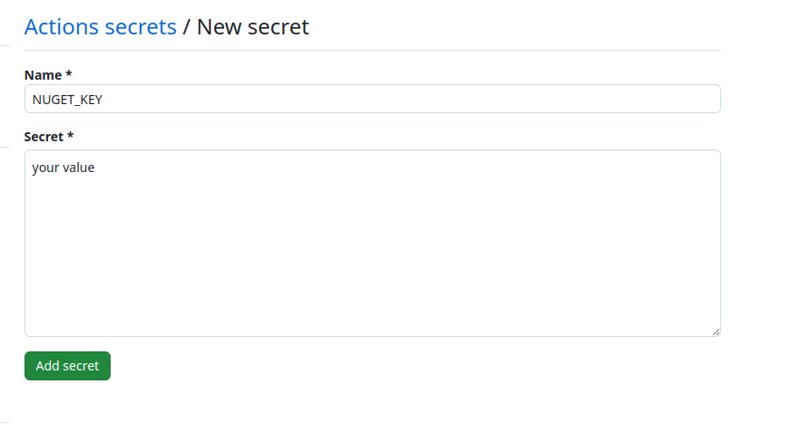

title: Creating dotnet tool and publishing it from github
created: Sunday, 29 December 2024
tags:
  - dotnet
  - dotnet tool
  - github
short: Build and share your own .NET command-line tools with this guide on creating and publishing them from GitHub.
image: /images/dotnet-tool2.jpeg
---
### Creating a .NET Tool and Publishing it from GitHub

#### Introduction

In the world of software development, creating custom tools can significantly enhance your workflow and streamline repetitive tasks. 
.NET tools offer a powerful and versatile approach to building cross-platform command-line utilities specifically designed for the .NET ecosystem. 
This article guides you through the process of creating a simple .NET tool and publishing it to GitHub, making it readily available for other developers.

##### Benefits of Creating .NET Tools

- Multiplatform Compatibility: .NET tools can seamlessly run on Windows, macOS, and Linux environments, ensuring broader accessibility.
- Global Tooling: Once published, your tool becomes accessible through the global tool pool, allowing users to invoke it from any project directory using the designated command.
- Reusable Functionality: Encapsulate common tasks within a .NET tool, promoting code reusability and reducing redundancy across projects.
- Improved Developer Experience: Streamline workflows by automating repetitive tasks and providing a consistent command-line interface for interacting with your code.

#### Step by step

Let's embark on creating a .NET tool named HelloTool that demonstrates a basic greeting functionality.

##### Project Setup
- Open your terminal and navigate to the desired directory for your project.
- Execute the following command to create a new console application:


```bash
dotnet new console -o HelloTool
```
Replace HelloTool with your preferred tool name.
- Next, create a solution file using this command:

```bash
dotnet new sln --name HelloTool
```
- Integrate the newly created console application project into the solution:
```bash
dotnet sln add HelloTool
```

##### Tool Implementation

- Open the Program.cs file within the HelloTool project directory.
- Modify the Main method to incorporate the greeting logic:

```csharp
Console.WriteLine($"Hello, {(args.Length>0?args[0]:"World")}!");
```
This code checks for any command-line arguments passed to the tool. If an argument exists, it's used as the name in the greeting. Otherwise, it defaults to "World."


##### Project Configuration for Packaging


-Prepare your tool for deployment to the NuGet package repository (nuget.org).
- Create a file named README.md within your solution directory. Provide a comprehensive description of your tool's purpose, usage instructions, and any relevant information for potential users.
- Modify the HelloTool.csproj file to include the following configurations:

```xml
<Project Sdk="Microsoft.NET.Sdk">

  <PropertyGroup>
    <OutputType>Exe</OutputType>
    <TargetFramework>net8.0</TargetFramework>
    <ImplicitUsings>enable</ImplicitUsings>
    <Nullable>enable</Nullable>

    <PackAsTool>true</PackAsTool>
    <ToolCommandName>hello</ToolCommandName>
    <PackageOutputPath>./nupkg</PackageOutputPath>


    <GeneratePackageOnBuild>true</GeneratePackageOnBuild>
    <PackageId>HelloTool</PackageId>
    <Authors>your name</Authors>
    <Company>tour email</Company>
    <Product>HelloTool</Product>
    <PackageReadmeFile>README.md</PackageReadmeFile>
    <PackageProjectUrl>https://github.com/dejandjenic/hello-tool</PackageProjectUrl>
  </PropertyGroup>


  <ItemGroup>

    <None Include="README.md" Pack="true" PackagePath="\" />

  </ItemGroup>
</Project>
```

This configuration specifies:
* PackAsTool: Indicates that the project should be packaged as a .NET tool.
* ToolCommandName: Defines the command used to invoke the tool from the command line (e.g., hello).
* PackageOutputPath: Sets the directory where the generated NuGet package will be placed.
* GeneratePackageOnBuild: Ensures the NuGet package is automatically created during the build process.
* PackageId, Authors, Company, Product: Provide details about your tool.
* PackageReadmeFile: Specifies the README.md file for documentation inclusion in

create a file called GetBuildVersion.psm1 and paste the code bellow

```pwsh
Function GetBuildVersion {
    Param (
        [string]$VersionString
    )

    # Process through regex
    $VersionString -match "(?<major>\d+)(\.(?<minor>\d+))?(\.(?<patch>\d+))?(\-(?<pre>[0-9A-Za-z\-\.]+))?(\+(?<build>\d+))?" | Out-Null

    if ($matches -eq $null) {
        return "1.0.0-build"
    }

    # Extract the build metadata
    $BuildRevision = [uint64]$matches['build']
    # Extract the pre-release tag
    $PreReleaseTag = [string]$matches['pre']
    # Extract the patch
    $Patch = [uint64]$matches['patch']
    # Extract the minor
    $Minor = [uint64]$matches['minor']
    # Extract the major
    $Major = [uint64]$matches['major']

    $Version = [string]$Major + '.' + [string]$Minor + '.' + [string]$Patch;
    if ($PreReleaseTag -ne [string]::Empty) {
        $Version = $Version + '-' + $PreReleaseTag
    }

    if ($BuildRevision -ne 0) {
        $Version = $Version + '.' + [string]$BuildRevision
    }

    return $Version
}
```


##### Streamlined Release Management with GitHub Actions

This section outlines how to leverage GitHub Actions for automated versioning and publishing of your .NET tool.

1. Release Branching:

* Implement a release branching strategy. Create a branch named like release/1.2.3 for each version you intend to publish.
2. GitHub Actions Workflow:

* Set up a GitHub Actions workflow to automate the build and publish process. The workflow will be triggered whenever a new branch is created under the release/* path.
3. Automatic Versioning:

* Within the workflow, utilize a script (like the provided GetBuildVersion.psm1) to extract the version number from the branch name (e.g., 1.2.3 from release/1.2.3). This extracted version will be used during the build process.
4. NuGet API Key:

* Obtain a NuGet API key from nuget.org. This key grants access to publish packages to the repository.
5. GitHub Repository Secret:

* In your GitHub repository's settings, navigate to the Secrets section and create a new secret named NUGET_KEY. Store the obtained NuGet API key as the value for this secret.
By following these steps, your GitHub Actions workflow will automatically handle version extraction, build the tool with the appropriate version, and publish the resulting NuGet package whenever a new release branch is created. This streamlines the release process and ensures consistency.





Navigate to the 'Actions' tab in your GitHub repository. Create a new workflow file (e.g., .github/workflows/dotnet.yml) and paste the following code into it.


```yaml

name: .NET

on:
  create:
    branches: 
      - release/**
  push:
    branches: [ "main" ]
  pull_request:
    branches: [ "main" ]

jobs:
  build:

    runs-on: ubuntu-latest

    steps:
    - uses: actions/checkout@v4
    - name: Get Build Version
      run: |
        Import-Module .\build\GetBuildVersion.psm1
        Write-Host $Env:GITHUB_REF
        $version = GetBuildVersion -VersionString $Env:GITHUB_REF
        echo "BUILD_VERSION=$version" | Out-File -FilePath $Env:GITHUB_ENV -Encoding utf-8 -Append
      shell: pwsh
    - name: Setup .NET
      uses: actions/setup-dotnet@v4
      with:
        dotnet-version: 8.0.x
    - name: Restore dependencies
      run: dotnet restore
    - name: Build
      run: dotnet build --no-restore -p:Version=$BUILD_VERSION 
    - name: Push
      if: startsWith(github.ref, 'refs/heads/release')
      run: dotnet nuget push **\*.nupkg --api-key "${{ secrets.NUGET_KEY }}" --source https://api.nuget.org/v3/index.json --skip-duplicate

```

Create a release branch and verify the build and deployment process.

Once your tool is published on nuget execute in terminal

```bash
dotnet tool install -g HelloTool
```

after installlation process is finished you can use your tool

```bash
hello dejan
```

should output "Hello dejan!"

github repo with this sample can be found https://github.com/dejandjenic/hello-tool

Happy coding!