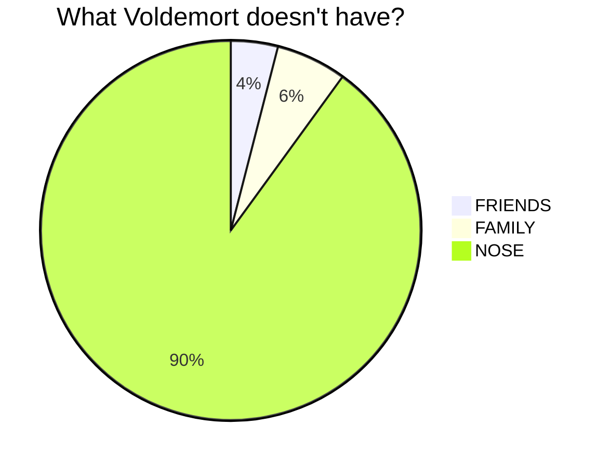
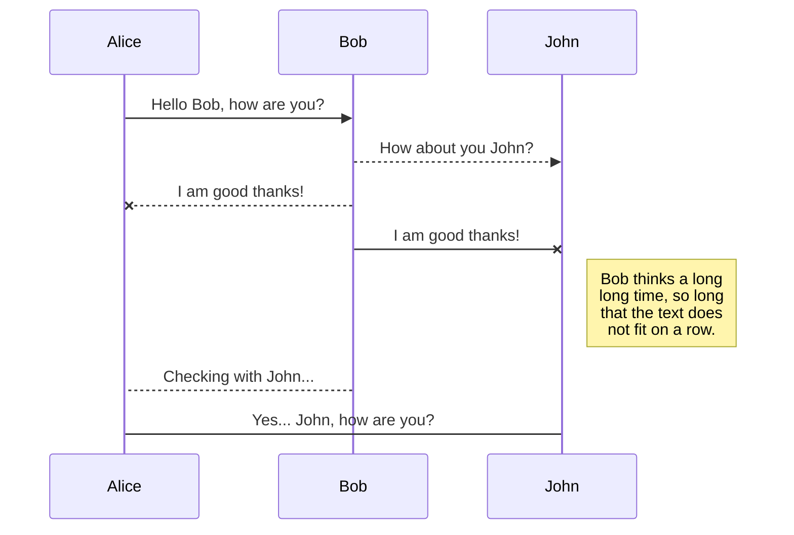
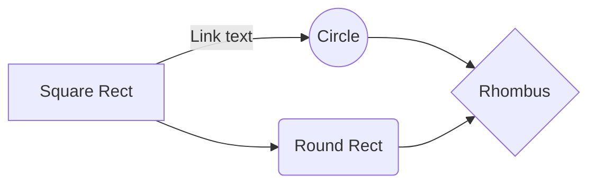
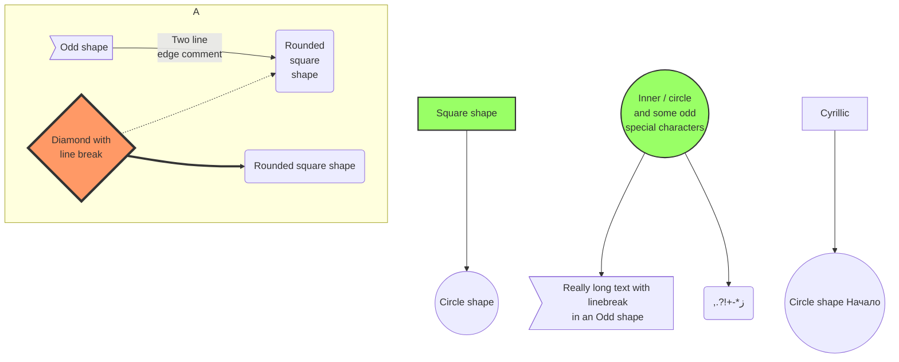
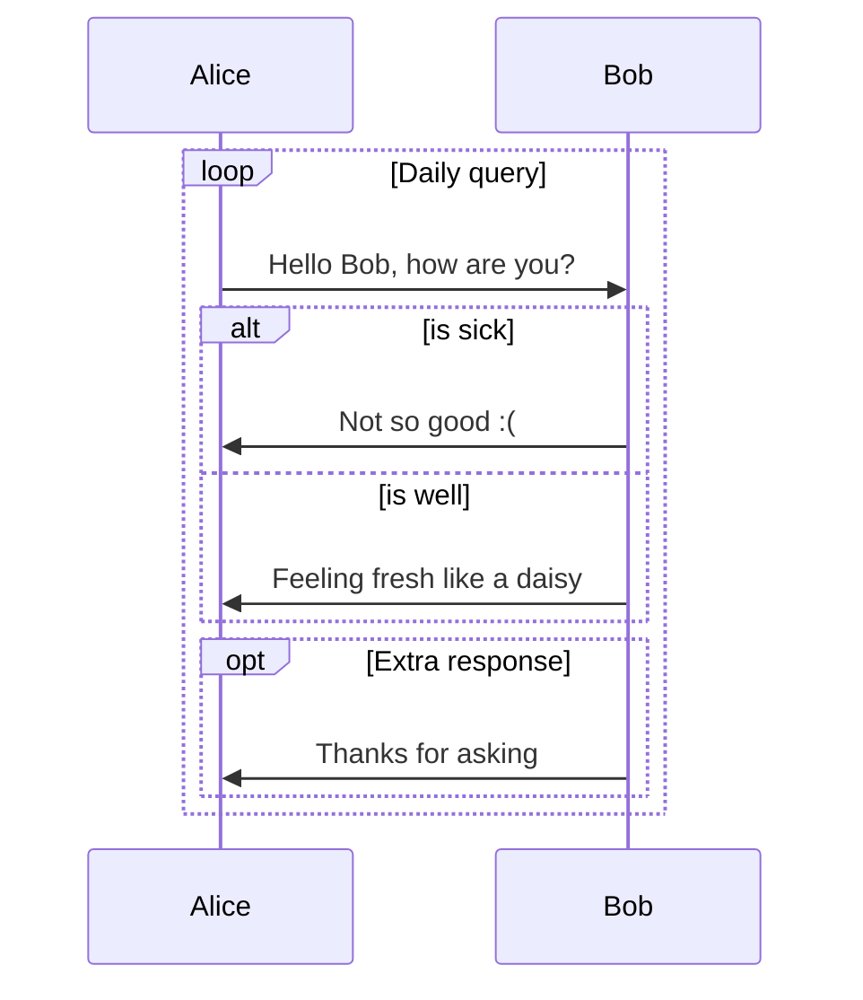

title: Diagrams with mermaidjs and GenesysSSG
created: Sunday, July 2, 2023
tags:
  - genesysSSG
  - mermaidjs
short: Diagrams with mermaidjs and GenesysSSG
---
# Diagrams with mermaidjs and GenesysSSG

Having diagrams on your site is always nice.

One of my favorite tools to create diagrams is [mermaidjs](https://mermaid.js.org/)

I wonted to investigate how easy would it be to integrate mermaid js with (genesysSSG)[https://dejandjenic.github.io/projects/genesysssg]

Lets check some examples of mermaidjs from this [link](https://mermaid.js.org/syntax/examples.html)

Create new blog post page with genesysSSG by running

```
genesysSSG -b "Test mermaidjs"
```


Copy and paste a few examples from mermaidjs


<pre>

</pre>


<pre>

</pre>


<pre>

</pre>


<pre>


</pre>


<pre>

</pre>

add mermaidjs initialization 

<pre>
&lt;script type=&quot;module&quot;&gt;
  import mermaid from &#39;https://cdn.jsdelivr.net/npm/mermaid@10/dist/mermaid.esm.min.mjs&#39;;

  mermaid.initialize({
  securityLevel: &#39;loose&#39;,
});

&lt;/script&gt;
</pre>

run genesysSSG locally 

```
genesysSSG -s -w
```

and check the results.

wanna see this page on live demo? check this [link](mermaid-demo.html)

how easy and how awesome that was!