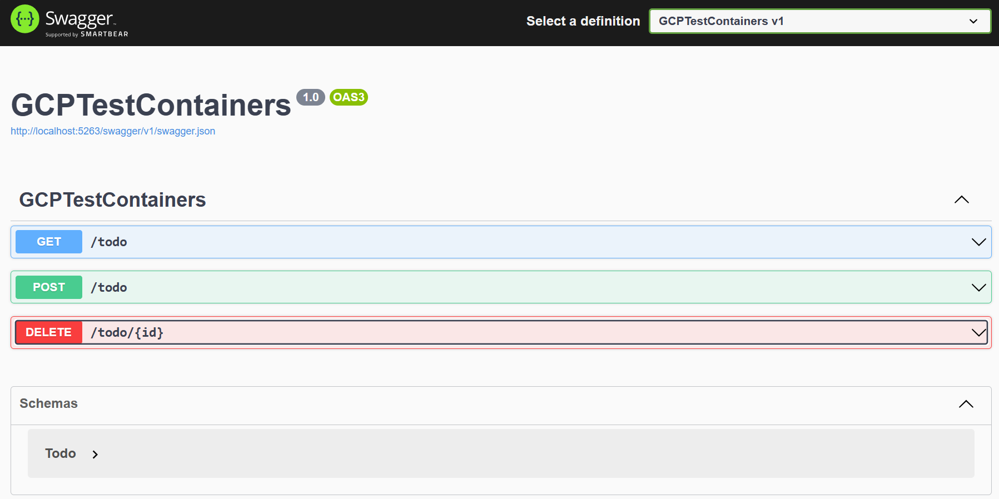
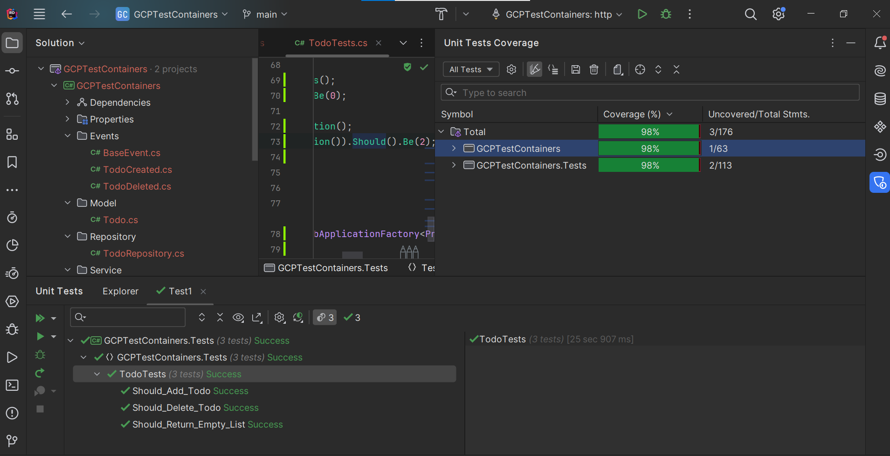

title: Functional testing with testcontainers
created: Monday, December 11, 2023
tags:
  - dotnet
  - testcontainers
  - tests
  - xunit
short: Functional testing with testcontainers
image: /images/multi_layer_cache.png
---
# Introduction

Functional testing is a crucial aspect of software development, ensuring that your application functions as expected in real-world scenarios. However, testing components with external dependencies, such as databases and message brokers, can be challenging. In this article, we explore how the TestContainers library simplifies functional testing by managing these dependencies effectively. We'll focus on using TestContainers with Google Cloud Platform's (GCP) Firestore and PubSub services in a .NET environment.

## Setting Up the API Project
I recently contributed to the TestContainers open-source library, with two of my pull requests included in the [3.6.0](https://github.com/testcontainers/testcontainers-dotnet/releases/tag/3.6.0) release. In this guide, we'll delve into the usage of GCP Firestore and PubSub features with TestContainers.

Let's assume we have a simple API for managing a to-do list. Our API uses Firestore as the operational database, storing only active to-dos, while PubSub is employed to publish messages for every API action. This allows us to build a reporting system without relying on the operational database.

Start by creating a .NET 8 API project and adding the necessary references:

```
Google.Cloud.Firestore
Google.Cloud.Firestore.V1
Google.Cloud.PubSub.V1
Microsoft.AspNetCore.OpenApi
Swashbuckle.AspNetCore
```


Next, add the required classes for your API:

```csharp
[FirestoreData]
public class Todo
{
    [FirestoreDocumentId]
    public string Id { get; set; }
    [FirestoreProperty]
    public string Text { get; set; }
}
```

## Creating the Firestore and PubSub Services

```csharp

public interface ITodoRepository
{
    Task<List<Todo>> List();
    Task Add(Todo item);
    Task Delete(string id);
}

public class TodoRepository(FirestoreDb db) : ITodoRepository
{
    public const string TodoCollectionName = "Todo";
    public async Task<List<Todo>> List()
    {
        return (await db.Collection(TodoCollectionName).GetSnapshotAsync()).
        Documents.
        Select(x => 
            x.ConvertTo<Todo>()).
        ToList();
    }

    public async Task Add(Todo item)
    {
        await db.
            Collection(TodoCollectionName)
            .Document().
            CreateAsync(item);
    } 
    
    public async Task Delete(string id)
    {
        await db.
            Collection(TodoCollectionName)
            .Document(id).
            DeleteAsync();
    } 
}
```


```csharp
public class BaseEvent
{
    public DateTime Date { get; set; } = DateTime.UtcNow;

    public string? Type => this.GetType().FullName;
}
```


```csharp
public class TodoCreated : BaseEvent
{
    
}

public class TodoDeleted : BaseEvent
{
    
}
```


```csharp
public interface IEventPublisher
{
    Task Publish(BaseEvent eventData);
}

public class EventPublisher(PublisherClientImpl client) : IEventPublisher
{
    public async Task Publish(BaseEvent eventData)
    {
        await client.PublishAsync(System.Text.Json.JsonSerializer.Serialize(eventData));
    }
}
```


```csharp
public interface ITodoService
{
    Task<List<Todo>> List();
    Task Add(Todo item);
    Task Delete(string id);
}

public class TodoService(ITodoRepository repository,IEventPublisher eventPublisher) : ITodoService
{
    public Task<List<Todo>> List()
    {
        return repository.List();
    }
    
    public async Task Add(Todo item)
    {
        await eventPublisher.Publish(new TodoCreated());
        await repository.Add(item);
    } 
    
    public async Task Delete(string id)
    {
        await eventPublisher.Publish(new TodoDeleted());
        await repository.Delete(id);
    } 
}
```

For abbreviation purposes, our Todo class serves both as a model for requests and an entity for the database, though it's not considered good practice.


```csharp
public class AppSettings
{
    public string ProjectId { get; set; }
    public string TopicName { get; set; }
}
```

Additionally, include an app configuration class and the main program file:


```csharp
var builder = WebApplication.CreateBuilder(args);

builder.Services.AddEndpointsApiExplorer();
builder.Services.AddSwaggerGen();

var appSettings = builder.Configuration.GetSection("AppSettings").Get<AppSettings>();
builder.Services.AddSingleton(appSettings);

builder.Services.AddSingleton(FirestoreDb.Create(appSettings.ProjectId));
builder.Services.AddSingleton((PublisherClientImpl)PublisherClientImpl.Create(new TopicName(appSettings.ProjectId,appSettings.TopicName)));
builder.Services.AddScoped<ITodoRepository,TodoRepository>();
builder.Services.AddScoped<ITodoService,TodoService>();
builder.Services.AddScoped<IEventPublisher,EventPublisher>();

var app = builder.Build();

if (app.Environment.IsDevelopment())
{
    app.UseSwagger();
    app.UseSwaggerUI();
}

app.UseHttpsRedirection();


app.MapGet("/todo", (ITodoService service) =>  service.List())
    .WithName("GetTodos")
    .WithOpenApi();

app.MapPost("/todo", (ITodoService service,[FromBody]Todo model) =>  service.Add(model))
    .WithName("CreateTodo")
    .WithOpenApi();

app.MapDelete("/todo/{id}", (ITodoService service,[FromRoute]string id) =>  service.Delete(id))
    .WithName("DeleteTodo")
    .WithOpenApi();

app.Run();

public partial class Program{}
```


after starting our api and checking swagger we would see something like this



we have 3 endpoints

1. list todos
2. create todo
3. delete todo

we store and retrieve this information from firestore database and we publish pubsub message after creating and deleting todo.

## Writing Functional Tests

Now, let's add a test project to our solution and include the necessary references:

```
FluentAssertions
Microsoft.AspNetCore.Mvc.Testing
Testcontainers.Firestore
Testcontainers.PubSub
Microsoft.NET.Test.Sdk
```

Reference your API project from the test project and add the following classes:


```csharp

public class CustomWebApplicationFactory<TProgram>
    : WebApplicationFactory<TProgram> where TProgram : class
{
    public Func<IServiceCollection,Task> OverideServices { get; set; }
	
    protected override void ConfigureWebHost(IWebHostBuilder builder)
    {
        builder.ConfigureServices(svc =>
        {
            if (OverideServices != null)
            {
                OverideServices(svc).GetAwaiter().GetResult();
            }
        });
    }
}
```

```csharp

public class TestBase 
    : IClassFixture<CustomWebApplicationFactory<Program>>
{
	
    private readonly CustomWebApplicationFactory<Program> _factory;
    protected HttpClient client;
    private static FirestoreDb firestoreDb;
    private static PublisherServiceApiClient publisher;
    private static SubscriberServiceApiClient subscriber;
    private static SubscriptionName subscriptionName;
    
    private static  Func<IServiceCollection,Task> OverideServices = async (svc) =>
    {
        var appSettings = svc.BuildServiceProvider().GetRequiredService<AppSettings>();
        await SetupFirestore(svc,appSettings);

        await SetupPubSub(svc,appSettings);
    };

    private static async Task SetupFirestore(IServiceCollection svc, AppSettings appSettings)
    {
        FirestoreContainer _firestoreContainer = new FirestoreBuilder().Build();
        await _firestoreContainer.StartAsync();
        
        
        var firestoreDbBuilder = new FirestoreDbBuilder();
        firestoreDbBuilder.ProjectId = appSettings.ProjectId;
        firestoreDbBuilder.Endpoint = _firestoreContainer.GetEmulatorEndpoint();
        firestoreDbBuilder.ChannelCredentials = ChannelCredentials.Insecure;

        firestoreDb = await firestoreDbBuilder.BuildAsync();

        svc.AddSingleton(firestoreDb);
    }

    private static async Task SetupPubSub(IServiceCollection svc, AppSettings appSettings)
    {
        PubSubContainer _pubSubContainer = new PubSubBuilder().Build();
        await _pubSubContainer.StartAsync();
        
        
        var projectId = appSettings.ProjectId;
        var topicId = appSettings.TopicName;
        var subscriptionId = $"{appSettings.TopicName}-sub";
		
        var topicName = new TopicName(projectId, topicId);
        subscriptionName = new SubscriptionName(projectId, subscriptionId);
		
        var publisherClientBuilder = new PublisherServiceApiClientBuilder();
        publisherClientBuilder.Endpoint = _pubSubContainer.GetEmulatorEndpoint();
        publisherClientBuilder.ChannelCredentials = ChannelCredentials.Insecure;
        
        var subscriberClientBuilder = new SubscriberServiceApiClientBuilder();
        subscriberClientBuilder.Endpoint = _pubSubContainer.GetEmulatorEndpoint();
        subscriberClientBuilder.ChannelCredentials = ChannelCredentials.Insecure;

	   
        publisher = await publisherClientBuilder.BuildAsync();
        subscriber = await subscriberClientBuilder.BuildAsync();
        
        publisher.CreateTopic(topicName);
        await subscriber.CreateSubscriptionAsync(subscriptionName, topicName, null, 60);
            
        svc.AddSingleton(
            new PublisherClientImpl(
                topicName, 
                new List<PublisherServiceApiClient>() { publisher },
                new PublisherClient.Settings(), 
                async () => { }));
    }

    public TestBase(CustomWebApplicationFactory<Program> factory)
    {
        _factory = factory;
        _factory.OverideServices = OverideServices;
        client = _factory.CreateClient();
    }

    public async Task ClearTodoCollection()
    {
        var collection = firestoreDb.Collection(TodoRepository.TodoCollectionName);
        foreach (var item in (await collection.GetSnapshotAsync()).Documents.Select(x=> x.ConvertTo<Todo>()))
        {
            await collection.Document(item.Id).DeleteAsync();
        }
    }

    public async Task<int> CheckSubscription()
    {
        var messages = await subscriber.PullAsync(subscriptionName, 5);
        await subscriber.AcknowledgeAsync(subscriptionName,messages.ReceivedMessages.Select(x=>x.AckId));
        return messages.ReceivedMessages.Count;
    }
	
}
```

the code above is used as a test base class, when invoked it starts docker container for pubsub and firestore (by using TestContainers library) and sets up environment for it.

now we have to add some tests


```csharp

public class TodoTests : TestBase
{

    async Task<List<Todo>> GetTodos()
    {
        return (await client.GetFromJsonAsync<List<Todo>>("/todo"))!;
    }
    
    private async Task<string> AddTodo()
    {
        var todoText = Guid.NewGuid().ToString();
        await client.PostAsJsonAsync("/todo", new Todo()
        {
            Text = todoText
        });
        return todoText;
    }
    
    private async Task DeleteTodo(string id)
    {
        await client.DeleteAsync($"/todo/{id}");
    }
    
    [Fact]
    public async Task Should_Return_Empty_List()
    {
        var response = await GetTodos();
        response.Count.Should().Be(0);
    }
    
    [Fact]
    public async Task Should_Add_Todo()
    {
        var todos = await GetTodos();
        todos.Count.Should().Be(0);

        var todoText = await AddTodo();

        todos = await GetTodos();
        todos.Count.Should().Be(1);
        todos.FirstOrDefault()!.Text.Should().Be(todoText);

        await ClearTodoCollection();
        (await CheckSubscription()).Should().Be(1);
    }

    

    [Fact]
    public async Task Should_Delete_Todo()
    {
        var todos = await GetTodos();
        todos.Count.Should().Be(0);

        var todoText = await AddTodo();
        
        todos = await GetTodos();
        todos.Count.Should().Be(1);
        todos.FirstOrDefault()!.Text.Should().Be(todoText);
        
        await DeleteTodo(todos.FirstOrDefault()!.Id);
        
        todos = await GetTodos();
        todos.Count.Should().Be(0);
        
        await ClearTodoCollection();
        (await CheckSubscription()).Should().Be(2);
    }

    

    public TodoTests(CustomWebApplicationFactory<Program> factory) : base(factory)
    {
        
    }
}
```

## Running the Tests and Analyzing Results

test server will be started and will execute api project, we did setup and registered with api project DI a special version for our services that we want to use with emulator, no code is changed in api project to achieve this.

we created test for our api, we ensured that when we create a todo it will appear in the list of all todos, we ensured that when we delete a todo it will not be shown on the list. We tested that api produces pubsub messages.

if we run tests now we see similar output



all tests have passed and out code coverage is 98%.

## Conclusion
In conclusion, using TestContainers simplifies functional testing by managing external dependencies effectively. In this guide, we explored its integration with GCP Firestore and PubSub, demonstrating how to set up an API project, write functional tests, and analyze the results. By following these practices, developers can ensure their applications are robust and reliable in real-world scenarios.


code used in this article can be found [here](https://github.com/dejandjenic/GCPTestContainers)

