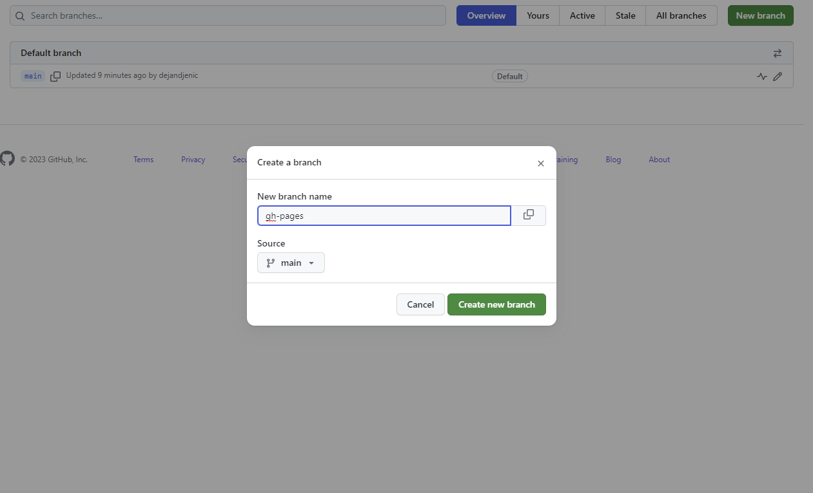
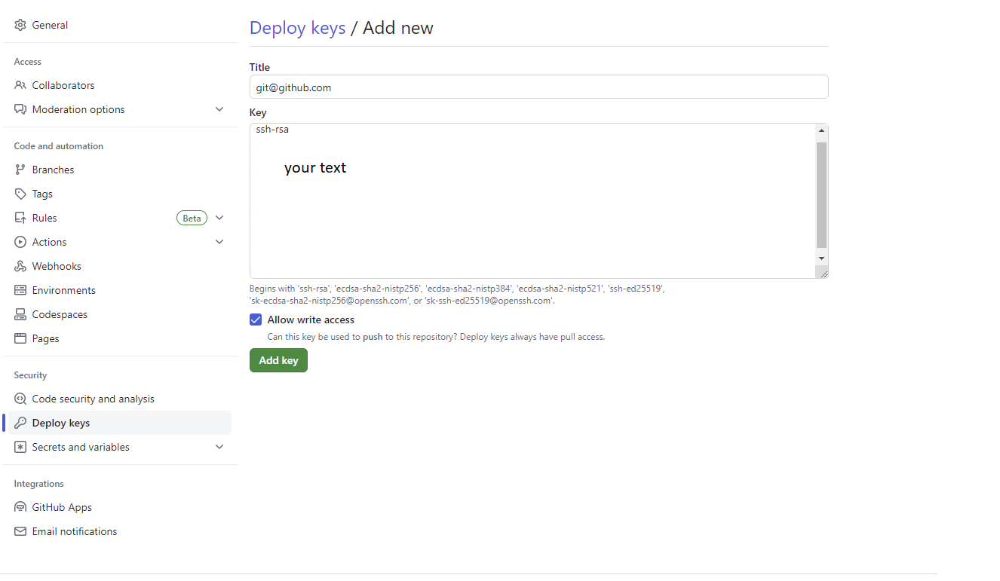
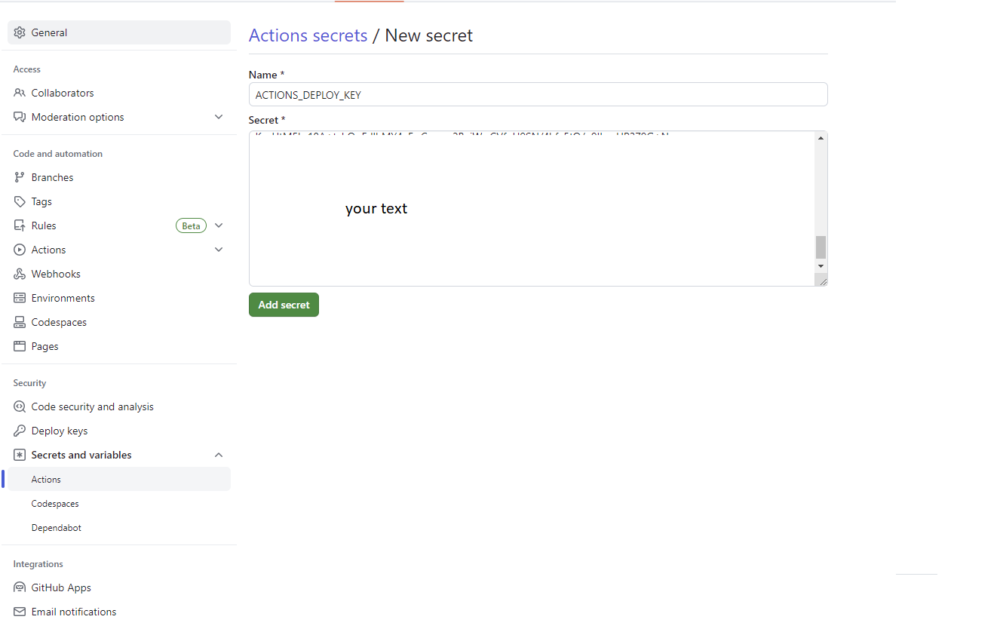
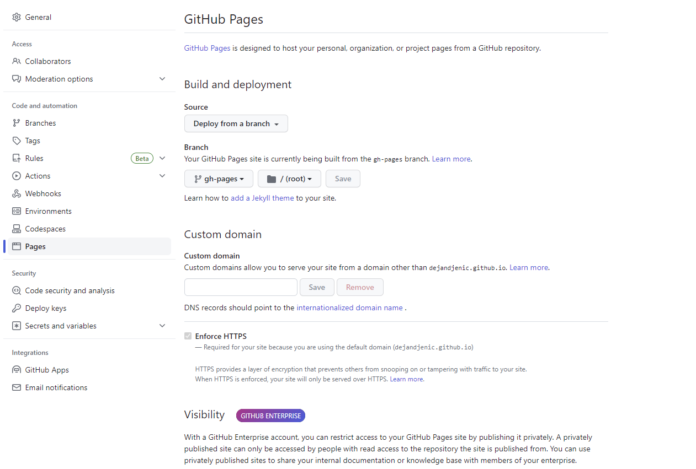
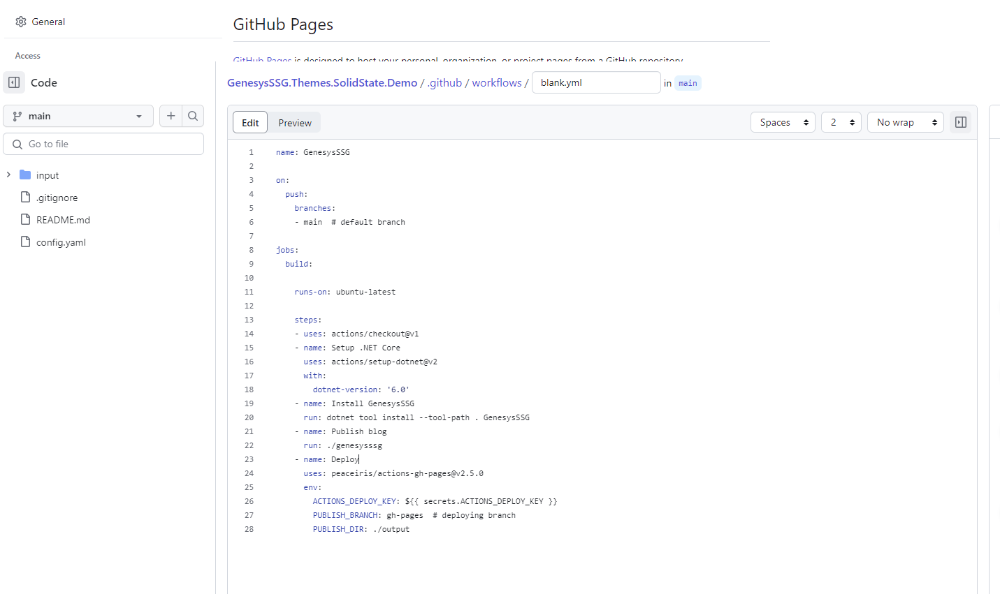
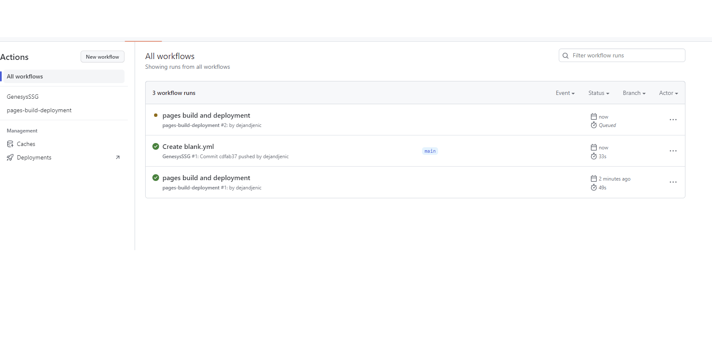

title: Personal blog with GenesysSSG and github pages
created: Thursday, June 22, 2023
tags:
  - introduction
  - github
  - github pages
  - personal blog
short: Easily create personal blog with GenesysSSG and github pages and host it for free
---
# Personal blog with GenesysSSG and github pages

Navigate to github and create repository in the following format username.github.io

## Git branches
create branch calld gh-pages that will be used to server generated content.



## Keys

execute following command to generate keys used to allow github to deploy code to new branch

```
ssh-keygen -t rsa -b 4096 -C "git@github.com"
```

this command will generate 2 files

1. private key , this will go to secrets tab in git 
2. public key 


### Install keys

navigate to settings of your repository on github and add new deploy key , as shown bellow



the value that should be entered is the value taken from the private key file.

navigate to Secrets and variables 



the value that should be entered is the value taken from the public key file.

## Setup github pages

Navigate to pages section and ensure that settings are configured as shown



## Generating static site

Clone your repository into local directory and navigate to it.

Install GenesysSSG 

```
dotnet tool install -g GenesysSSG
```

generate new site with genesysSSG

```
genesysssg -n
```

add new blog item 

```
genesysssg -b "First blog"
```

open directory with text editor like VS Code

```
code .
```

edit blogs/firstblog.md

if you want to see generated content run 

```
genesysssg -w -s
```

when finished push code to git remote

## Actions

navigate to actions and add new manual action



paste content into new action field

```

name: GenesysSSG

on:
  push:
    branches:
    - main  # default branch

jobs:
  build:

    runs-on: ubuntu-latest

    steps:
    - uses: actions/checkout@v1
    - name: Setup .NET Core
      uses: actions/setup-dotnet@v2
      with:
        dotnet-version: '6.0'
    - name: Install GenesysSSG
      run: dotnet tool install --tool-path . GenesysSSG
    - name: Publish blog
      run: ./genesysssg
    - name: Deploy
      uses: peaceiris/actions-gh-pages@v2.5.0
      env:
        ACTIONS_DEPLOY_KEY: ${{ secrets.ACTIONS_DEPLOY_KEY }}
        PUBLISH_BRANCH: gh-pages  # deploying branch
        PUBLISH_DIR: ./output
```

save and commit

this will checkout your code, install and run genesysSSG on commit to main and publish results to gh-pages branch

after commit action will be run



## Verification

navigate your browser to username.github.io and verify that your content is published