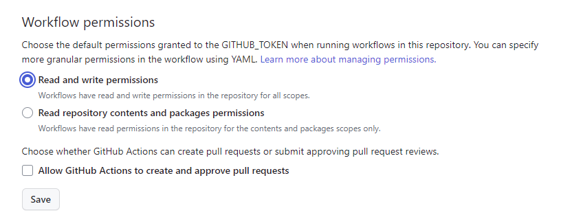
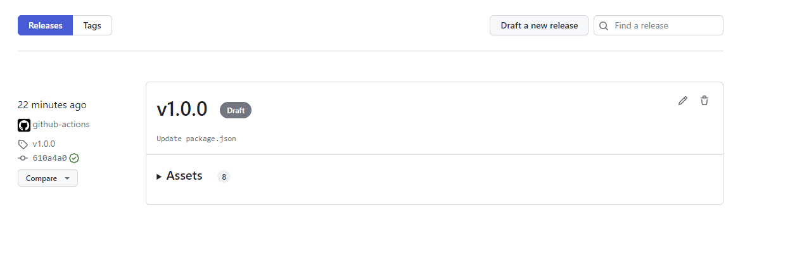
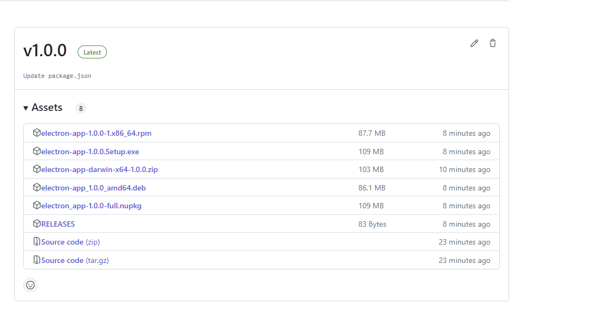
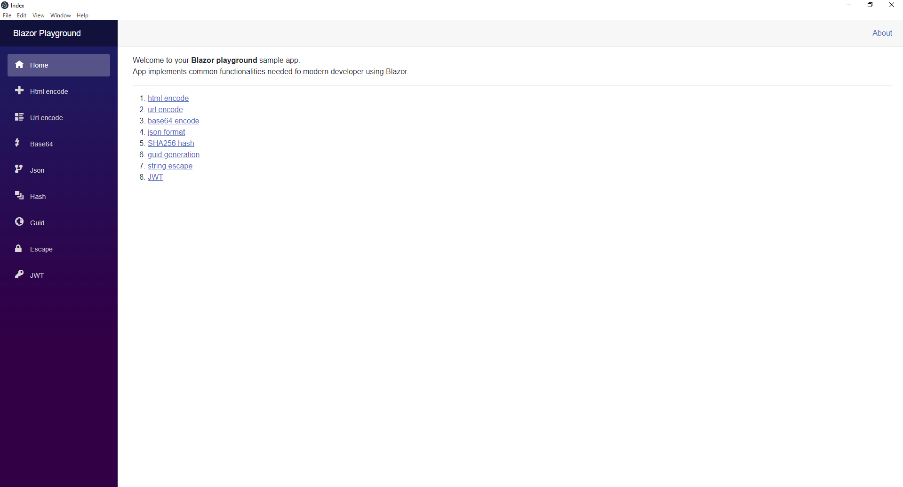
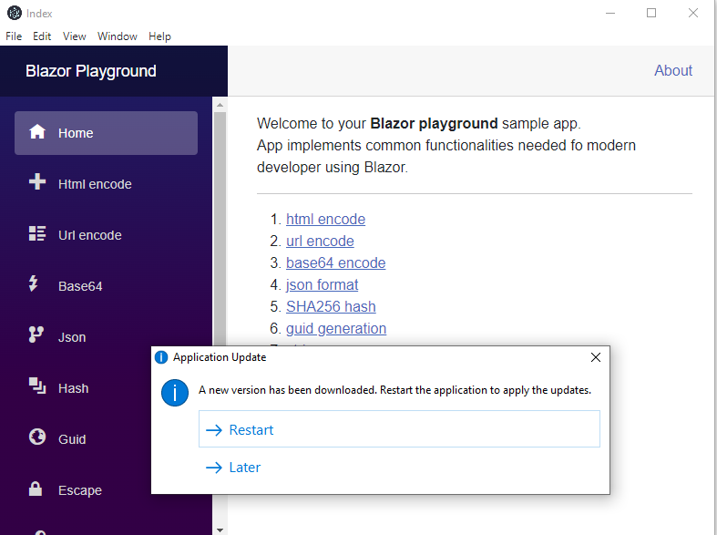

title: Publishing blazor WASM with electron.js
created: Wednesday, August 30, 2023
tags:
  - Blazor
  - WebAssembly
  - Electron.js
  - dotnet
short: Discover how to seamlessly deploy Blazor WebAssembly applications using Electron.js, leveraging the power of automatic updates and streamlining the deployment process through GitHub Actions. Elevate your user experience and ensure your application is always up-to-date.
image: /images/blazor_electron.png
pinOrder: 1
pinned: true
---
### Mastering Cross-Platform Deployment: Blazor WASM Applications with Electron.js and Auto-Updates via GitHub Actions

#### Introduction

In the dynamic landscape of web application development, the need to bring web technologies closer to the desktop experience has led to innovative solutions. In this tutorial, we will explore the fusion of Blazor WebAssembly (WASM) with Electron.js—a framework for building cross-platform desktop applications using web technologies. By combining these two technologies, we can deliver the power of Blazor WASM applications in a standalone desktop environment.

#### Prerequisites
Before we dive into the deployment process, make sure you have the following prerequisites set up:

A functional Blazor application (You can refer to my previous article on [Exploring Blazor and Deployment Options](https://medium.com/@dejandjenic/exploring-blazor-and-deployment-options-da81c2c301aa) for guidance on setting up a Blazor project).

#### Project Setup
To embark on this journey, we'll create a new repository and structure our project accordingly:

* Create a new repository for your project.
* Inside this repository, create a directory named "blazor" to hold your existing Blazor application files.
* Copy all the Blazor application files from your previous repository to the "blazor" directory.
* Additionally, create an "electron-app" directory at the root of your repository.

#### Initializing Electron.js
Our next step involves setting up Electron.js to create the bridge between our Blazor application and the desktop environment:

* Navigate to the "electron-app" directory and execute the following commands:

```bash
npm init
npm install electron --save-dev
```

* These commands will initialize a new project and add Electron as a development dependency.


```javascript
// main.js

// Modules to control application life and create native browser window
const { app, BrowserWindow } = require('electron')
const path = require('path')
require('update-electron-app')(

)

const createWindow = () => {
  console.log(__dirname)
  // Create the browser window.
  const mainWindow = new BrowserWindow({
    width: 800,
    height: 600,
    webPreferences: {
      preload: path.join(__dirname, 'preload.js'),      
    }
  })

  // and load the index.html of the app.
  mainWindow.loadFile('index.html')  
  
  // Open the DevTools.
  // mainWindow.webContents.openDevTools()
}

// This method will be called when Electron has finished
// initialization and is ready to create browser windows.
// Some APIs can only be used after this event occurs.
app.whenReady().then(() => {
  createWindow()

  app.on('activate', () => {
    // On macOS it's common to re-create a window in the app when the
    // dock icon is clicked and there are no other windows open.
    if (BrowserWindow.getAllWindows().length === 0) createWindow()
  })
})

// Quit when all windows are closed, except on macOS. There, it's common
// for applications and their menu bar to stay active until the user quits
// explicitly with Cmd + Q.
app.on('window-all-closed', () => {
  if (process.platform !== 'darwin') app.quit()
})

// In this file you can include the rest of your app's specific main process
// code. You can also put them in separate files and require them here.
```

#### Loading the Blazor Application
To integrate our Blazor application, we'll create a script named loadBlazor.js. This script adjusts the base URL and loads the Blazor scripts:


```javascript

function addScript(value, element, prop){
    var el = document.createElement(element);
    el[prop] = value;
    document.getElementsByTagName('head')[0].appendChild(el);
    return el;
}

let url = document.baseURI.replace("index.html","")

addScript(url, "base", "href")
addScript(url + "_framework/blazor.webassembly.js", "script", "src")

setTimeout(()=>{
    addScript(url, "a", "href").click()
},1000)

```

#### Electron Forge for Packaging and Publishing
Electron Forge simplifies packaging and publishing our Electron application. Let's add necessary dependencies and create configuration files:

* Install Electron Forge:
```bash
npm install --save-dev @electron-forge/cli @electron-forge/publisher-github
```

* Create a forge.config.js configuration file:

```javascript
module.exports = {
  packagerConfig: {
    asar: true,
  },
  rebuildConfig: {},
  makers: [
    {
      name: '@electron-forge/maker-squirrel',
      config: {},
    },
    {
      name: '@electron-forge/maker-zip',
      platforms: ['darwin'],
    },
    {
      name: '@electron-forge/maker-deb',
      config: {},
    },
    {
      name: '@electron-forge/maker-rpm',
      config: {},
    },
  ],
  plugins: [
    {
      name: '@electron-forge/plugin-auto-unpack-natives',
      config: {},
    },
  ],
  publishers: [
    {
      name: '@electron-forge/publisher-github',
      config: {
        repository: {
          owner: 'dejandjenic',
          name: 'BlazorPlaygroundElectron'
        },
        prerelease: false
      }
    }
  ]
};
```

This configuration demonstrates that you're generating application packages for different platforms like Windows, macOS, Debian-based (Linux), and RPM-based (Linux) distributions.

Additionally, in your GitHub Actions workflow configuration, you could highlight that the pipeline runs on different operating systems:

```yaml
name: Blazor Playground

on:
  push:
    tags:
      - '*'

jobs:  
  release:
    runs-on: ${{ matrix.os }}

    strategy:
      matrix:
        os: [windows-latest, ubuntu-latest, macos-latest]

    steps:
      - name: Check out Git repository
        uses: actions/checkout@v1

      - name: Setup .NET Core
        uses: actions/setup-dotnet@v2
        with:
          dotnet-version: '7.0'

    
      - name: Publish
        run: dotnet publish blazor/BlazorPlayground.csproj -c Release -o release
      - name: Install ReplaceInFile
        run: dotnet tool install --tool-path . ReplaceInFile
      - name: Modify original file index.html
        run: ./replaceinfile "release/wwwroot/index.html" '<base href=\"/\" />' ""
      - name: Modify original file index.html
        run: ./replaceinfile "release/wwwroot/index.html" '<script src=\"_framework/blazor.webassembly.js\"></script>' ""
      - name: Modify original file index.html
        run: ./replaceinfile "release/wwwroot/index.html" "</body>" '<script src=\"loadBlazor.js\"></script></body>'
      - name: Copy blazor output
        run: cp -r ./release/wwwroot/* ./electron-app/
        
      - name: Install Node.js, NPM and Yarn
        uses: actions/setup-node@v3
        with:
          node-version: 20

      - name: Restore npm dependencies
        run: npm ci
        working-directory: ./electron-app/

      - name: Publish app
        run: npm run publish
        working-directory: ./electron-app/
        if: github.ref_type == 'tag'
        env:
          GITHUB_TOKEN: ${{ github.token }}

```

By specifying different operating systems like Windows, Ubuntu (Linux), and macOS in the workflow, you're implicitly indicating that the application is being built and tested for these platforms.

Remember, you can adjust these sections to provide clearer details about your application's cross-platform compatibility and the role of Electron Forge in generating packages for different operating systems.

## Images

Setting required permissions for GitHug actions



Draft release created by publishing electron app


Released version


Running application on windows


Application is being updated


#### Conclusion: Elevating Your Application with Auto-Updates and CI/CD
In the realm of application deployment, the marriage of Blazor WASM and Electron.js brings forth an integration that bridges web experiences and desktop functionality. Throughout this tutorial, we've traversed the complete journey, from establishing a project structure to deploying your application via Electron Forge. However, the story doesn't end here—two integral factors deserve special attention: Auto-Updates and Continuous Integration and Continuous Deployment (CI/CD) through GitHub Actions.

##### Empowering User Experience with Auto-Updates

Introducing an invaluable feature, Electron.js brings automatic updates to the forefront. This game-changing capability ensures that your application remains current, delivering bug fixes, feature enhancements, and security patches seamlessly, without requiring manual user interventions. The result is an elevated user experience, an aspect pivotal to the success of any Electron application.

##### Exemplifying Auto-Update in Our Project

Within our project, the auto-update functionality is seamlessly integrated using the update-electron-app package. When a new version is released, users are prompted to update, ensuring they continually benefit from the latest improvements. This feature not only improves the user experience but also streamlines the maintenance process for developers.

##### Effortless Releases with CI/CD through GitHub Actions

The journey doesn't stop with auto-updates; we've also embraced the prowess of GitHub Actions for CI/CD. By leveraging this automation tool, the deployment process transforms into an orchestrated symphony of tasks. Each release, when tagged, triggers a cascade of actions: building, packaging, and publishing. GitHub Actions introduces consistency and reliability to your deployment pipeline, significantly reducing manual intervention and potential errors.

##### Unleash Your Application's Potential

With your Blazor WASM application now elegantly fused with Electron.js, empowered by auto-updates, and fortified by CI/CD through GitHub Actions, the horizon of possibilities is vast. Delve into advanced Electron.js features, optimize performance, and craft an immersive user experience that resonates with both web and desktop enthusiasts.

#### Embark on Your Development Odyssey
Ready to embark on your own development journey? The complete codebase and resources employed in this tutorial are at your fingertips in the [GitHub repository](https://github.com/dejandjenic/BlazorPlaygroundElectron). Feel free to explore, experiment, and shape the code to fit your unique projects.

As we conclude, remember that the fusion of Blazor WASM and Electron.js, accentuated by auto-updates and fortified by GitHub Actions, redefines the landscape of desktop applications. With every release cycle smoothly orchestrated, your application evolves seamlessly, delivering the latest features and enhancements to your audience with unparalleled convenience.


<style>img{max-width:100%}</style>