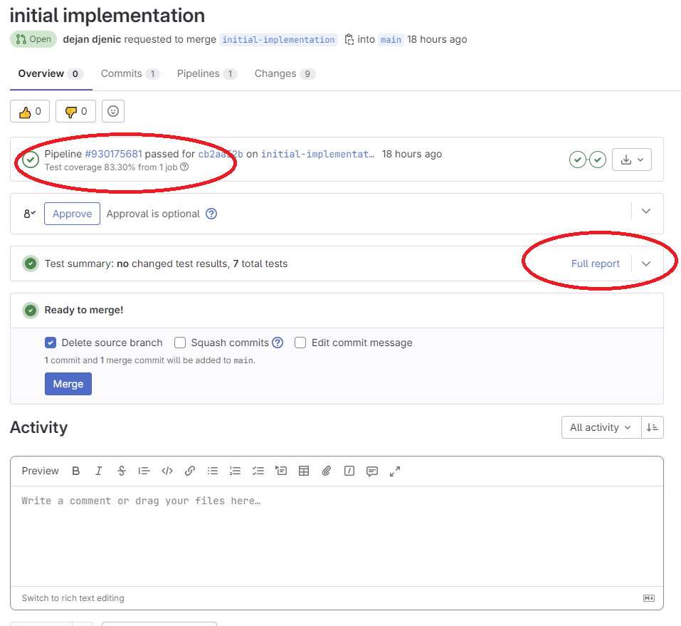
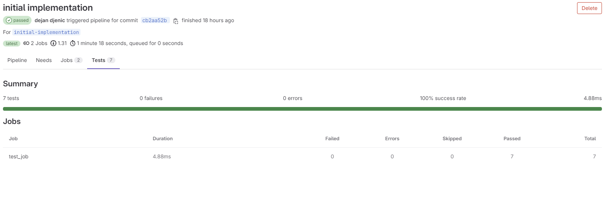
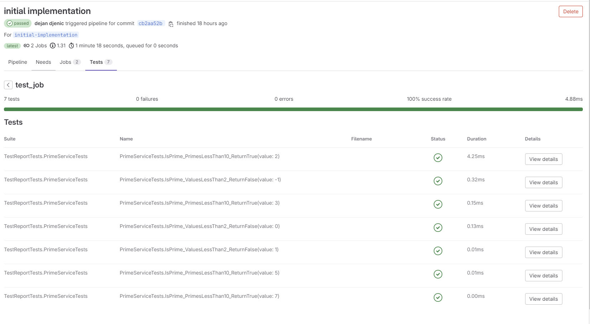
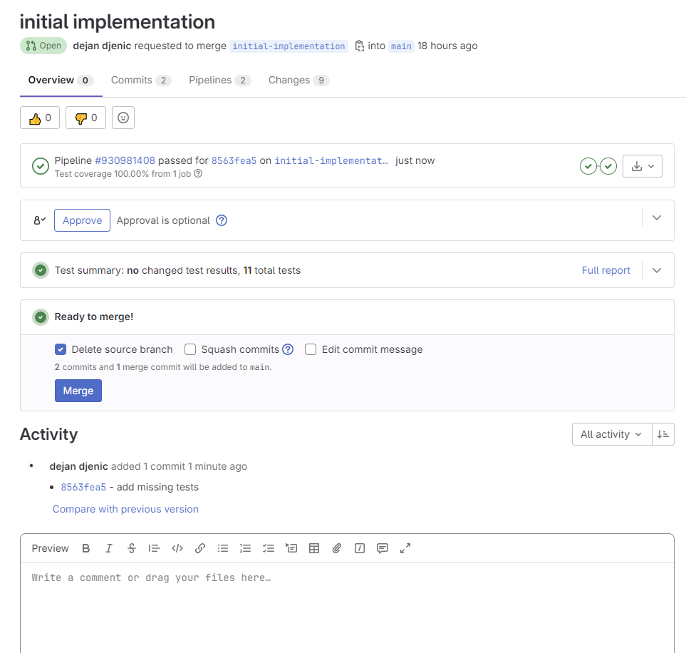
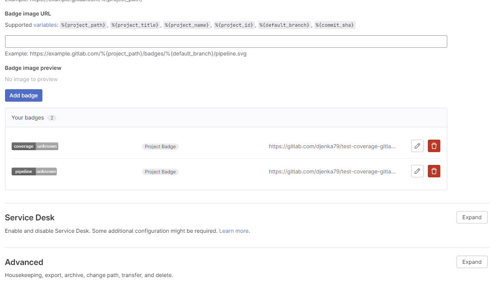
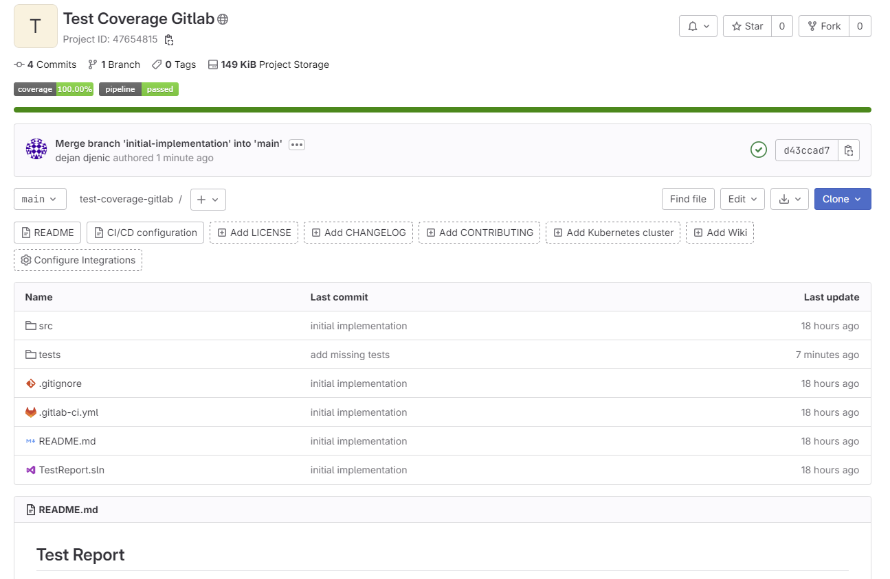

title: Enhancing Test Visualization on GitLab with .NET Projects
created: Saturday, July 22, 2023
tags:
  - gitlab
  - .NET
  - dotnet
  - tests
  - xunit
short:  This article explores the power of test visualization in GitLab for .NET projects. It provides insights into configuring GitLab CI/CD pipelines, defining test stages and jobs, and installing dependencies for testing. The article also demonstrates how to create a merge request, view test reports with detailed information, and improve code coverage. Additionally, it covers configuring useful settings in GitLab, such as badges, and highlights the benefits of test visualization for optimizing software testing workflows.
---
#  Enhancing Test Visualization on GitLab with .NET Projects

## Introduction

In modern software development, efficient testing is crucial to ensure the stability and quality of applications. GitLab, a popular web-based Git repository management tool, offers a wide range of features to support the testing process. One such feature is test visualization, which provides developers with valuable insights into the test execution and results. This article explores how test visualization can be leveraged within GitLab for .NET projects, empowering teams to optimize their testing workflows and improve overall project quality.


## Understanding Test Visualization in GitLab

### Overview of GitLab's test visualization capabilities

GitLab provides a dedicated section within its user interface for visualizing test results and metrics. It offers a comprehensive overview of test execution, allowing developers to track the progress and outcomes of their tests.


### Key benefits of using test visualization in software development

Test visualization in GitLab brings several advantages to the software development process

1. Enhanced visibility: Developers can easily monitor the status and trends of their tests, gaining insights into test coverage, pass rates, and failure patterns.
1. Early bug detection: Test visualization helps identify failing tests early in the development cycle, enabling prompt bug fixes and preventing issues from reaching production.
1. Test prioritization: By analyzing test results, teams can prioritize their efforts and allocate resources to fix critical or frequently failing tests.
1. Performance monitoring: Test visualization allows for tracking the performance of tests over time, highlighting any degradation or improvements in test execution


### Integration with Continuous Integration/Continuous Deployment (CI/CD) pipelines

GitLab seamlessly integrates test visualization into its CI/CD pipelines. Developers can configure test stages and jobs within the pipeline to automatically trigger test execution and generate visualized reports. This integration ensures that testing becomes an integral part of the development workflow.

## Setting Up .Net Project

To create a new project and include the sample code provided by Microsoft https://learn.microsoft.com/en-us/dotnet/core/testing/unit-testing-code-coverage?tabs=windows, follow these steps:

Inside the project directory, create a file named PrimeService.cs and add the following code


```csharp
public class PrimeService
    {
        public bool IsPrime(int candidate)
        {
            if (candidate < 2)
            {
                return false;
            }

            for (int divisor = 2; divisor <= Math.Sqrt(candidate); ++divisor)
            {
                if (candidate % divisor == 0)
                {
                    return false;
                }
            }
            return true;
        }
    }
```

Create a test project within the same project directory. You can name it anything you prefer.

Add a reference to the project that contains PrimeService.cs. In your test project, add a reference to the project containing the PrimeService class.


Inside the test project, create a file named PrimeServiceTests.cs and add the following code:


```csharp
public class PrimeServiceTests
    {
        readonly PrimeService _primeService;

        public PrimeServiceTests() => _primeService = new PrimeService();

        [Theory]
        [InlineData(-1), InlineData(0), InlineData(1)]
        public void IsPrime_ValuesLessThan2_ReturnFalse(int value) =>
            Assert.False(_primeService.IsPrime(value), $"{value} should not be prime");

        [Theory]
        [InlineData(2), InlineData(3), InlineData(5), InlineData(7)]
        public void IsPrime_PrimesLessThan10_ReturnTrue(int value) =>
            Assert.True(_primeService.IsPrime(value), $"{value} should be prime");
    }
```


Now you have a project with the PrimeService class and corresponding unit tests. You can proceed with configuring your CI/CD pipeline in GitLab and visualizing the test results using the test visualization capabilities.

## Setting Up GitLab for .NET Project Testing


1. Configuring GitLab CI/CD pipelines for .NET projects
1. Defining test stages and jobs within the pipeline
1. Installing necessary dependencies and tools for testing

In the root directory of your project, create a .gitlab-ci.yml file and add the following content

```yaml
image:
  name: mcr.microsoft.com/dotnet/sdk:7.0

stages:
  - build
  - test

build_job:
  stage: build
  only:
    - pushes  
  script:
    - dotnet build

test_job:
  stage: test
  only:
    - pushes
  script:
    - dotnet test --results-directory $CI_PROJECT_DIR/cobertura --collect:"XPlat Code Coverage" --test-adapter-path:. --logger:"junit;LogFilePath=..\artifacts\{assembly}-test.xml;MethodFormat=Class;FailureBodyFormat=Verbose"
    - cp $CI_PROJECT_DIR/cobertura/*/coverage.cobertura.xml $CI_PROJECT_DIR/cobertura/coverage.cobertura.xml
    - dotnet tool install -g dotnet-reportgenerator-globaltool
    - dotnet tool install -g CodeCoverageExtractor
    - /root/.dotnet/tools/reportgenerator -reports:"$CI_PROJECT_DIR/cobertura/coverage.cobertura.xml" -targetdir:"coveragereport" -reporttypes:"Html"
    - /root/.dotnet/tools/codecoverageextractor $CI_PROJECT_DIR/cobertura/coverage.cobertura.xml
    - tar -cvf coveragereport.tar coveragereport/
  artifacts:
    when: always
    expire_in: 1 week
    paths:
      - ./**/*test.xml
      - $CI_PROJECT_DIR/cobertura/coverage.cobertura.xml
      - coveragereport.tar
    reports:
      junit:
        - ./**/*test.xml
      coverage_report:
        coverage_format: cobertura
        path: $CI_PROJECT_DIR/cobertura/coverage.cobertura.xml
        
  dependencies:
    - build_job
  coverage: /total_coverage=(\d+.?\d?)/

```

The .gitlab-ci.yml file defines two stages: build and test. The build_job stage builds the project, and the test_job stage runs the tests.

The pipeline script installs the dotnet-reportgenerator-globaltool and CodeCoverageExtractor tools for generating test reports and extracting code coverage information.

By configuring GitLab CI/CD pipelines, defining test stages and jobs, and installing the required dependencies and tools, you can automate the build and test process for your .NET projects on GitLab. The pipeline script generates test reports, including code coverage, and provides valuable artifacts and reports for further analysis.

## Action

Perform the following actions after setting up GitLab for .NET project testing

1. Create a new merge request with the code you just created. This will trigger the pipeline to run
1. Once the pipeline is executed, it should display a status similar to the following:



The image shows the pipeline status, a link to the full test report, and information about the code coverage percentage (83.30%).

Navigate to the test report page to view detailed information about the test jobs that were executed, including the duration of each job, final results, and details about each test executed, such as input parameters, duration, result, and logs




From the test report, you can observe that not all of the code is covered by tests; it is currently at 83.30% coverage.

Append the following test to your test project


```csharp
[Theory]
        [InlineData(4), InlineData(6), InlineData(8), InlineData(9)]
        public void IsPrime_NonPrimesLessThan10_ReturnFalse(int value) =>
            Assert.False(_primeService.IsPrime(value), $"{value} should not be prime");
```


Commit and push your changes to the merge request and wait for the pipeline to finish.




The results will show that your code now has 100% coverage.

Configure additional useful settings for your GitLab project:

1. Navigate to Settings -> General page and expand "Badges."
1. Add the following entries:


```
https://gitlab.com/djenka79/test-coverage-gitlab/badges/main/pipeline.svg
https://gitlab.com/djenka79/test-coverage-gitlab/badges/main/coverage.svg
```




Merge your merge request, and once the pipeline is finished, your project's overview page should display information about running pipelines and code coverage.



The overview page will show information about the running pipelines and the code coverage percentage.

By following these actions, you can leverage the GitLab pipeline and test visualization features to monitor the progress of your tests, track code coverage, and ensure the quality of your .NET projects.
## Conclusion

With GitLab's robust test visualization capabilities, .NET project teams can gain valuable insights into the testing process, leading to improved software quality and accelerated development cycles. By leveraging test visualization, developers can identify bottlenecks, enhance collaboration, and optimize their testing strategies. Incorporating test visualization into the GitLab workflow empowers teams to make informed decisions and continuously improve their software testing practices.


code used to create this article can be found https://gitlab.com/djenka79/test-coverage-gitlab
